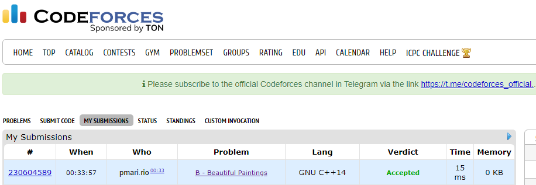
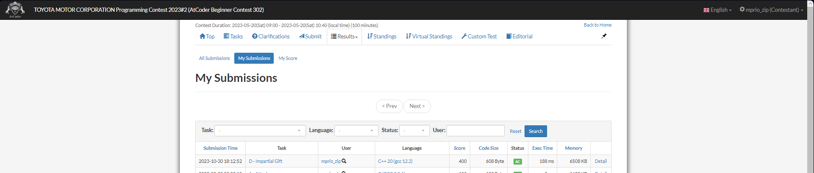
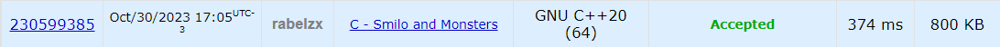
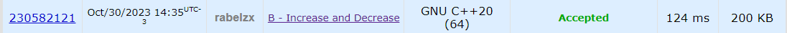

# Exercícios Online

**Conteúdo da Disciplina**: Greed (Algorítimos Ambiciosos) 

## Alunos
|Matrícula | Aluno |
| -- | -- |
| 21/1030729  |  Eric Rabelo Borges |
| 19/0058455  |  Mariana Oliveira Pires do Rio |

## Sobre 
Este projeto contém as resoluções de exercícios de Juiz Online que envolvem algorítimos ambiciosos. 

### Exercício 1:  [Beautiful Paintings](https://codeforces.com/contest/651/problem/B)

Esse exercício tem como contexto existe uma nova exposição a ser montada e existem diversas pinturas bonitas a serem exibidas, queremos que os visitantes fiquem cada vez mais felizes ao olhar de uma pintura a outra. Para isso precisamos de reordenar varios quadros pelo "valor" de sua beleza, de forma que eu consiga formar a maior quantidade de duplas aonde o quadro i seja menos belo que seu sucessor i+1, a partir dessa logica, vamos retornar o número máximo possível de vezes que o visitante pode ficar feliz ao passar todas as fotos.

Confira o enunciado do exercício [aqui](https://codeforces.com/contest/651/problem/B)

- [Ir para solução](Soluções/BeautifulPaintings.cpp)

### Exercício 2: [Impartial Gift](https://atcoder.jp/contests/abc302/tasks/abc302_d)

O exercício tem como objetivo encontrar a maior soma de valor entre 2 "presentes" para os dois amigos do Takahashi, em que a diferença dos dois valores não pode ser maior que um valor de entrada "D". Para essa solução usamos uma visão gulosa com dois ponteiros para se escolher os maiores valores de cada opção de presente dentre as entradas.

Confira o enunciado do exercício [aqui](https://atcoder.jp/contests/abc302/tasks/abc302_d)

- [Ir para solução](Soluções/ImpartialGift.cpp)

### Exercício 3:  [Smilo and Monsters](https://codeforces.com/problemset/problem/1891/C)

Neste exercício, o jogador Smilo enfrenta diversas hordas de monstros com a opção de dois tipos de ataques. O primeiro ataque elimina um monstro de uma horda, enquanto o segundo tipo permite a eliminação de um grupo de monstros em uma única horda, desde que haja um número mínimo igual ou superior ao valor do contador de combo. O código resolve o problema eficientemente ao calcular a soma total de monstros, ordenar as hordas e, em seguida, adotar uma estratégia que prioriza ataques individuais para hordas menores e, quando possível, utiliza ataques em grupo. Dessa forma, o código minimiza o número total de ataques necessários para vencer o jogo, otimizando a estratégia com base nas condições específicas do problema.

Confira o enunciado do exercício [aqui](https://codeforces.com/problemset/problem/1891/C)

- [Ir para solução](Soluções/SmiloAndMonsters.cpp)

### Exercício 4:  [Increase And Decrease](https://codeforces.com/problemset/problem/246/B)

O exercício proposto envolve a equalização de elementos de um vetor para que todos se tornem iguais à média dos valores no vetor. Para alcançar esse objetivo, o algoritmo segue uma abordagem gananciosa, percorrendo o vetor e fazendo escolhas locais com base nas diferenças entre os elementos e a média. Em cada passo, ele ajusta os elementos para se aproximarem da média, considerando se cada elemento é maior ou menor do que a média, transferindo ou retirando a diferença para ou do próximo elemento à direita. O resultado final é o número de elementos que foram igualados à média durante o processo, refletindo a eficácia do algoritmo na equalização dos elementos.

Confira o enunciado do exercício [aqui](https://codeforces.com/problemset/problem/246/B)

- [Ir para solução](Soluções/IncreaseAndDecrease.cpp)

## Screenshots

### Beautiful Paintings

### Impartial Gift

### Smilo and Monsters

### Increase And Decrease

## Instalação 
Não é necessario instalação. As soluções podem ser submetidas nos sites: [AtCoder](https://atcoder.jp/) e [Codeforces](https://codeforces.com/).

**Linguagem**: C++ 

## Apresentação
Assista o vídeo explicativo do projeto clicando [aqui](/Greed_Video.mp4).  
*Observação: A apresentação está em formato .mp4, portanto, faça o download para assisti-la.*

